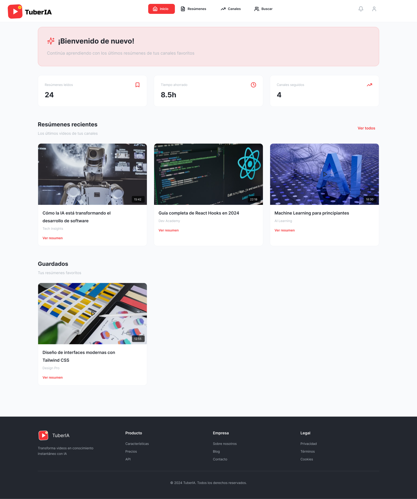
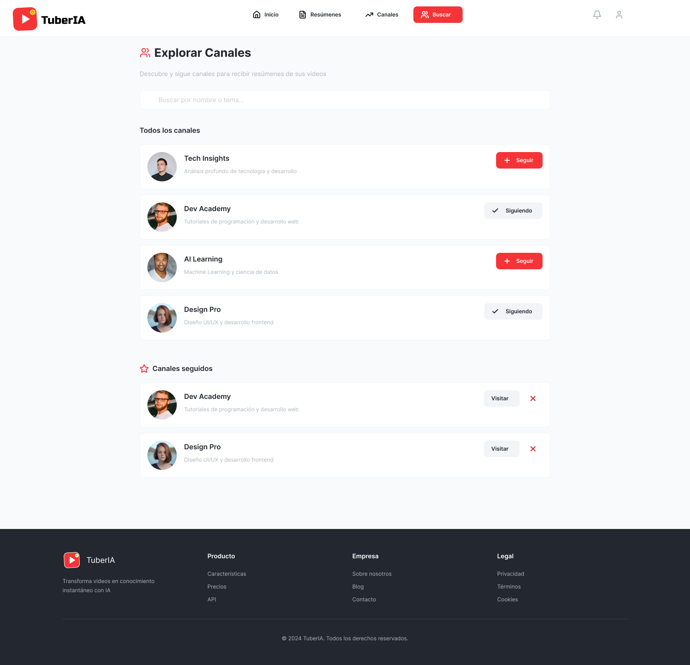
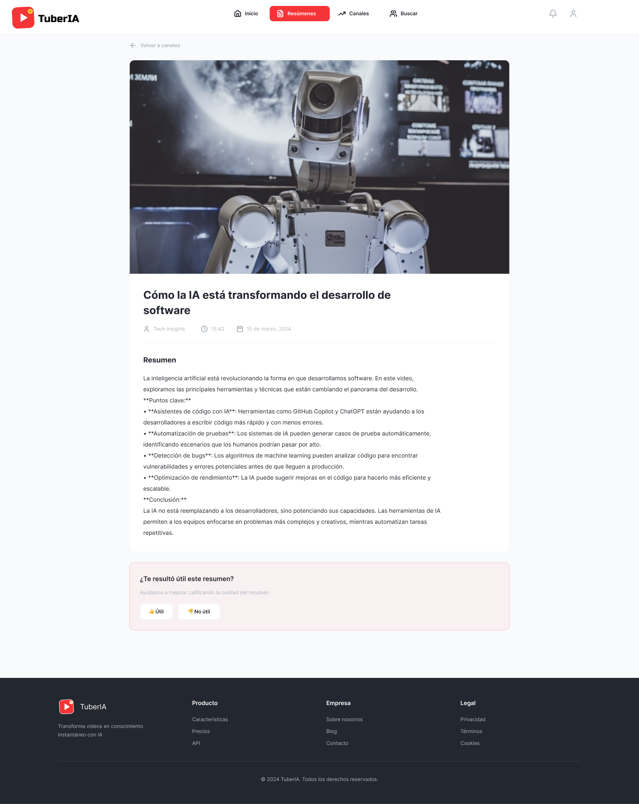
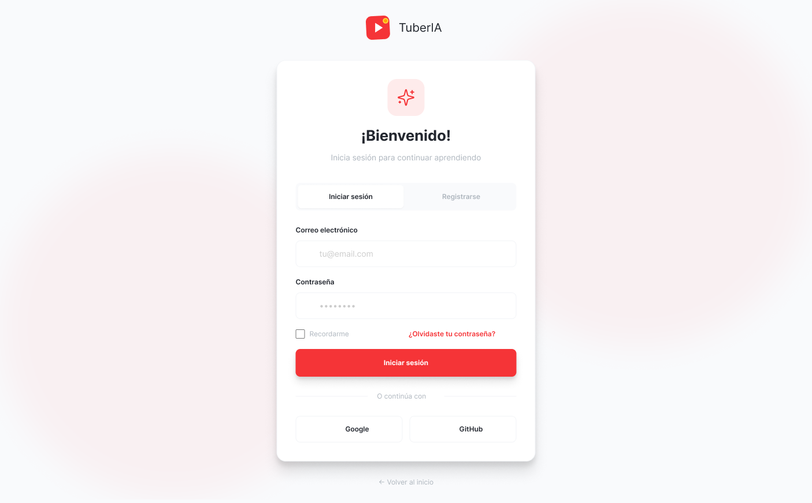

# TuberIA


**AI-powered YouTube video summarization platform**

---

## Table of Contents

- [Description](#description)
- [Live Demo](#live-demo)
- [Features](#features)
- [Tech Stack](#tech-stack)
- [Screenshots](#screenshots)
- [Installation](#installation)
- [Development](#development)
- [API Documentation](#api-documentation)
- [Project Structure](#project-structure)
- [Contributing](#contributing)
- [Team](#team)
- [License](#license)

---

## Description

**TuberIA** is a web platform that uses artificial intelligence to automate YouTube channel monitoring. Users receive structured summaries of new videos without manual intervention.

The problem we solve: Students and professionals waste time watching long videos or abandon channels of interest due to content overload. Our solution combines automatic video detection + transcription + AI summarization to deliver key content in minutes.

---

## Live Demo

**Production URL:** [https://tuberia.app](https://tuberia.app)

---

## Features

- **Automatic Channel Monitoring** - Follow YouTube channels and get notified of new videos
- **AI-Powered Summaries** - Get concise summaries of video content using OpenRouter AI
- **Key Points Extraction** - Quickly understand video highlights with bullet points
- **Personal Dashboard** - Organize and track your followed channels in one place
- **Responsive Design** - Works seamlessly on desktop and mobile devices
- **Real-time Processing** - Videos are processed automatically via background jobs with BullMQ
- **Secure Authentication** - JWT-based auth with refresh token rotation

---

## Tech Stack

| Layer | Technologies |
|-------|-------------|
| **Frontend** | React 18, Vite, Tailwind CSS, Context API |
| **Backend** | Node.js 20, Express 5.1, JWT, BullMQ |
| **Database** | MongoDB 8, Redis 7 |
| **Infrastructure** | Docker, Docker Compose, Caddy (reverse proxy), GitHub Actions |
| **Monitoring** | Sentry (frontend + backend), Winston logging |
| **External APIs** | YouTube RSS Feeds, youtube-transcript-plus, OpenRouter AI |

---

## Screenshots

<details>
<summary>View mockups</summary>

### Dashboard


### Channel Search


### Video Summary


### Login


</details>

---

## Installation

### Prerequisites

- Docker and Docker Compose installed
- Git

### Quick Start

```bash
# 1. Clone the repository
git clone https://github.com/TuberIA-App/TuberIA.git
cd TuberIA

# 2. Copy environment variables
cp .env.example .env
# Edit .env with your credentials (JWT secrets, OpenRouter API key, etc.)

# 3. Start containers
docker compose up -d

# 4. Access the application
# Frontend: http://localhost:5173
# Backend API: http://localhost:5000
```

---

## Development

### Local Development (with hot-reload)

```bash
# Frontend
cd frontend && npm install && npm run dev

# Backend
cd backend && npm install && npm run dev
```

### Running Tests

```bash
# Backend tests
cd backend && npm test

# Frontend lint
cd frontend && npm run lint
```

### Docker Commands

```bash
# Build and start all services
docker compose up --build

# Stop all services
docker compose down

# View logs
docker compose logs -f
```

---

## API Documentation

Full API documentation is available in the `/docs/dev` directory:

| Endpoint | Documentation |
|----------|---------------|
| Authentication | [api-auth.md](docs/dev/api-auth.md) |
| Videos | [api-videos.md](docs/dev/api-videos.md) |
| Channels | [api-channels.md](docs/dev/api-channels.md) |
| Users | [api-users.md](docs/dev/api-users.md) |

Additional documentation:
- [Deployment Guide](docs/dev/DEPLOYMENT.md)
- [Docker Configuration](docs/dev/README-DOCKER.md)
- [Redis & BullMQ](docs/dev/README-REDIS.md)

---

## Project Structure

```
TuberIA/
├── frontend/              # React + Vite application
│   ├── src/
│   │   ├── components/    # Reusable UI components
│   │   ├── pages/         # Page components
│   │   ├── hooks/         # Custom React hooks
│   │   ├── context/       # React Context providers
│   │   ├── services/      # API service layer
│   │   └── config/        # Configuration (Sentry, etc.)
│   └── Dockerfile
├── backend/               # Node.js + Express API
│   ├── src/
│   │   ├── controllers/   # Route handlers
│   │   ├── services/      # Business logic
│   │   ├── model/         # Mongoose schemas
│   │   ├── routes/        # API routes
│   │   ├── middlewares/   # Express middlewares
│   │   ├── workers/       # BullMQ workers
│   │   ├── queues/        # Job queue definitions
│   │   └── utils/         # Utility functions
│   └── Dockerfile
├── docs/dev/              # Technical documentation
├── design/                # Wireframes and mockups
├── .github/workflows/     # CI/CD with GitHub Actions
├── docker-compose.yml     # Docker orchestration
├── Caddyfile             # Reverse proxy configuration
└── README.md
```

---

## Contributing

We welcome contributions! Please read our [Contributing Guide](CONTRIBUTING.md) for details on:

- Setting up the development environment
- Code style guidelines
- Commit message conventions
- Pull request process

---

## Team

| Member | GitHub | Role |
|--------|--------|------|
| **Ezequiel** | [@obezeq](https://github.com/obezeq) | Backend Lead |
| **Natalia** | [@Naleper90](https://github.com/Naleper90) | Frontend Lead |
| **Alfonso** | [@acasmor0802](https://github.com/acasmor0802) | Database Manager |

---

## License

This project is licensed under the [PolyForm Noncommercial License 1.0.0](LICENSE). This license allows personal, educational, and noncommercial use only. Commercial use is not permitted.

---

## Troubleshooting

### Docker containers won't start

```bash
docker compose down -v
docker compose up --build
```

### MongoDB connection errors

- Ensure MongoDB is running: `docker compose ps`
- Check MONGODB_URI in your .env file
- Verify network connectivity between containers

### API rate limits

- The app uses YouTube RSS feeds (no API key required for basic usage)
- OpenRouter has usage limits based on your plan

### Environment variables not loading

- Ensure .env file exists in the root directory
- Check that all required variables are set (see .env.example)
- Restart containers after .env changes
