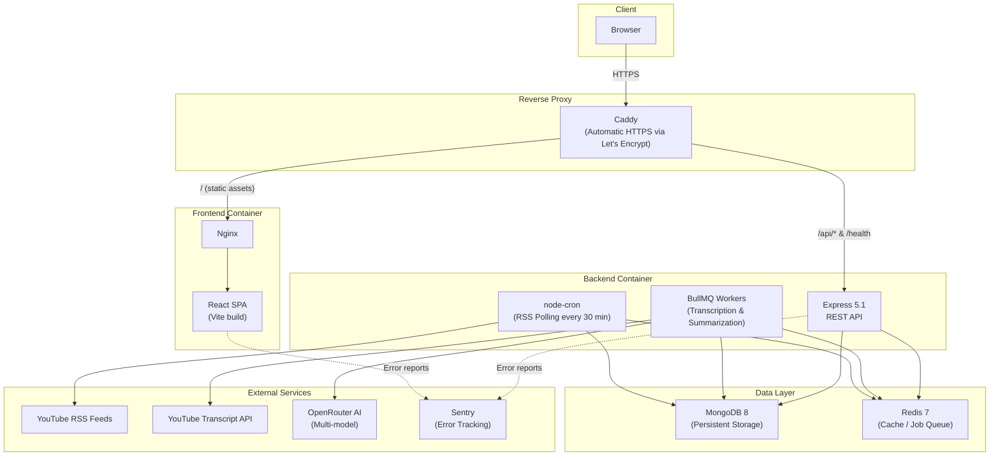

# TuberIA Architecture

> **AI-powered YouTube video summarization platform built with the MERN stack.**
>
> Production URL: [https://tuberia.app](https://tuberia.app)

---

## Table of Contents

- [System Overview](#system-overview)
- [Architecture Diagram](#architecture-diagram)
- [Frontend Architecture](#frontend-architecture)
  - [Directory Structure](#directory-structure)
  - [Routing](#routing)
  - [State Management](#state-management)
  - [HTTP Layer](#http-layer)
  - [Styling](#styling)
- [Backend Architecture](#backend-architecture)
  - [Middleware Chain](#middleware-chain)
  - [Service Layer Pattern](#service-layer-pattern)
  - [Background Workers](#background-workers)
  - [RSS Polling](#rss-polling)
  - [Authentication](#authentication)
- [Data Layer](#data-layer)
  - [MongoDB Models](#mongodb-models)
    - [User](#user)
    - [Channel](#channel)
    - [Video](#video)
    - [UserChannel](#userchannel)
  - [Redis Usage](#redis-usage)
- [Infrastructure](#infrastructure)
  - [Docker Compose](#docker-compose)
  - [Reverse Proxy and HTTPS](#reverse-proxy-and-https)
  - [CI/CD Pipeline](#cicd-pipeline)
  - [Security Scanning](#security-scanning)
- [API Reference](#api-reference)
  - [Health](#health-endpoints)
  - [Authentication](#authentication-endpoints)
  - [Channels](#channel-endpoints)
  - [Users](#user-endpoints)
  - [Videos](#video-endpoints)
- [Technical Decisions](#technical-decisions)

---

## System Overview

TuberIA is a full-stack web application that allows users to follow YouTube channels and automatically receive AI-generated summaries of new videos. The platform eliminates the need to watch entire videos by providing concise summaries, key points, and full transcriptions powered by large language models.

**Core workflow:**

1. A user signs up and follows YouTube channels through search.
2. A background cron job polls YouTube RSS feeds every 30 minutes to detect new videos.
3. When a new video is discovered, BullMQ workers fetch its transcript and send it to an AI model via OpenRouter.
4. The AI generates a summary and key points, which are stored and displayed in the user's personalized feed.

**Technology stack:**

| Layer        | Technology                                  |
| ------------ | ------------------------------------------- |
| Frontend     | React 18, Vite, React Router, Tailwind CSS  |
| Backend      | Node.js, Express 5.1, BullMQ, node-cron     |
| Database     | MongoDB 8 (Mongoose ODM)                    |
| Cache/Queue  | Redis 7 (BullMQ job queue, token blacklist) |
| AI Provider  | OpenRouter (multi-model access)             |
| Proxy        | Caddy (automatic HTTPS)                     |
| Containers   | Docker Compose                              |
| CI/CD        | GitHub Actions                              |
| Monitoring   | Sentry (frontend and backend)               |

---

## Architecture Diagram



**Request flow:**

1. The browser sends all requests over HTTPS to Caddy.
2. Caddy routes static asset requests (`/`) to the Nginx container serving the React SPA.
3. Caddy routes API requests (`/api/*`) and health checks (`/health`) to the Express backend.
4. The Express backend reads from and writes to MongoDB and Redis.
5. BullMQ workers run inside the backend container, consuming jobs from Redis and calling external APIs.
6. The cron job runs inside the backend container, polling RSS feeds and enqueuing new video jobs.

---

## Frontend Architecture

### Directory Structure

```
frontend/src/
├── App.jsx                    # Root component, route tree, context providers
├── main.jsx                   # Application entry point, React DOM mount
├── components/
│   ├── common/                # Reusable UI: buttons, inputs, cards, modals, logo, skip-link
│   ├── Layout/                # Header, Footer, MainLayout, PrivateLayout, PublicHeader
│   ├── ChannelItem/           # Channel display component
│   ├── SearchBar/             # Channel search component
│   └── ProtectedRoute.jsx     # Auth gate for private routes
├── pages/                     # Route-level views, each with paired CSS
│   ├── Home/                  # Public landing page
│   ├── Auth/                  # Login and registration
│   ├── Dashboard/             # User dashboard with stats
│   ├── ChannelSearch/         # Channel discovery and follow
│   ├── MyFeedPage/            # Personalized video feed
│   ├── UserHome/              # User home view
│   └── VideoDetail/           # Individual video summary view
├── context/
│   ├── AuthContext.jsx         # Authentication state (tokens, login/logout, current user)
│   └── UserDataContext.jsx     # User data (followed channels, personalized feed)
├── hooks/
│   └── useMyFeed.js           # Custom hook for feed data fetching and management
├── services/
│   ├── api.js                 # Axios instance configuration
│   ├── api.interceptor.js     # Request/response interceptors (token injection, refresh)
│   ├── auth.service.js        # Auth API calls (register, login, logout, refresh)
│   ├── channel.service.js     # Channel API calls (search, follow, unfollow)
│   ├── user.service.js        # User API calls (stats, channels)
│   └── video.service.js       # Video API calls (feed, detail)
└── styles/
    ├── globals.css             # Global styles
    ├── variables.css           # CSS custom properties (design tokens)
    └── base/                   # Browser reset, typography, utility classes
```

### Routing

The application uses **React Router** with a clear separation between public and private zones:

- **Public routes:** Landing page (`/`), authentication (`/login`, `/register`), and channel search. These are accessible without authentication and use `PublicHeader` and `MainLayout`.
- **Private routes:** Dashboard, feed, channel details, and video detail views. These are wrapped with the `ProtectedRoute` component that checks `AuthContext` before rendering. They use `PrivateLayout` with a full navigation header and footer.

Navigation is fully client-side (SPA). The Nginx configuration handles fallback to `index.html` for HTML5 history mode.

### State Management

TuberIA uses React's built-in **Context API** with two global contexts:

| Context            | Purpose                                                                               |
| ------------------ | ------------------------------------------------------------------------------------- |
| `AuthContext`      | Manages authentication tokens (access + refresh), login/logout actions, current user  |
| `UserDataContext`  | Centralizes user-specific data (followed channels, feed) to avoid deep prop drilling  |

Both contexts wrap the application at the root level in `App.jsx`. Components consume them via `useContext` hooks. This approach was chosen over Redux because the global state scope is limited to authentication and user data, which does not warrant the added complexity of an external state management library.

### HTTP Layer

All API communication flows through a centralized **Axios** configuration:

1. **`api.js`** creates a configured Axios instance with the base URL and default headers.
2. **`api.interceptor.js`** attaches request and response interceptors:
   - **Request interceptor:** Injects the JWT access token from `AuthContext` into the `Authorization` header of every outgoing request.
   - **Response interceptor:** Detects `401 Unauthorized` responses, attempts a silent token refresh using the refresh token, and retries the failed request. If the refresh also fails, the user is logged out.
3. **Domain-specific services** (`auth.service.js`, `channel.service.js`, etc.) expose high-level functions like `channelService.search(query)` that abstract away HTTP details, endpoint paths, and error handling from components.

### Styling

The design system combines two approaches:

- **CSS Custom Properties** (`variables.css`): Define the design token system including color palette, font families, font sizes, spacing scale, border radii, and shadows. This ensures consistent visual language and enables easy theme adjustments.
- **Tailwind CSS utilities**: Used alongside custom CSS for rapid layout and spacing adjustments.
- **Page-scoped CSS**: Each page has an associated CSS file (`Home.css`, `Dashboard.css`, etc.) for view-specific styles, preventing global style conflicts.
- **Base styles** (`styles/base/`): Browser reset, typography defaults, and shared utility classes.

---

## Backend Architecture

### Middleware Chain

The Express 5.1 application configures middleware in a precise order. Each layer has a specific responsibility, and the order matters for correctness and security.

```
Request
  │
  ├─ 1. Sentry Initialization          (error tracking instrumentation)
  │
  ├─ 2. Trust Proxy                     (accurate client IP behind Caddy)
  │
  ├─ 3. Health Check Routes             (mounted at root level: GET /health)
  │
  ├─ 4. Helmet                          (security headers: CSP, HSTS, X-Frame, etc.)
  │
  ├─ 5. CORS                            (origin whitelist, credentials, allowed methods)
  │
  ├─ 6. Rate Limiter (general)          (per-IP limit on /api/* routes)
  │
  ├─ 7. Rate Limiter (auth)             (stricter limit on /api/auth/* routes)
  │
  ├─ 8. Body Parser                     (JSON + URL-encoded, 10MB limit)
  │
  ├─ 9. Timeout                         (30-second request timeout)
  │
  ├─ 10. Request Logger                 (logs method, URL, IP, user agent)
  │
  ├─ 11. API Routes                     (mounted at /api prefix)
  │
  ├─ 12. 404 Not Found Handler          (catches unmatched routes)
  │
  ├─ 13. Sentry Error Handler           (captures exceptions for reporting)
  │
  └─ 14. Global Error Handler           (formats error responses, last middleware)
```

**Key details from the implementation:**

- **Sentry** is initialized first via `initSentry(app)` so it can instrument all subsequent middleware.
- **Health checks** are mounted before security middleware to ensure load balancers can reach `/health` without being blocked by rate limiting or CORS.
- **CORS** is environment-aware: in production it restricts to `FRONTEND_URL`; in development it allows `localhost:5173` and `localhost:3000`.
- **Two rate limiters** are applied: a general limiter for all `/api` routes and a stricter one specifically for `/api/auth` to prevent brute-force attacks.
- **Body parser** accepts payloads up to 10MB to handle large transcription data.
- The **timeout middleware** (30 seconds) prevents hanging requests from consuming server resources.

### Service Layer Pattern

The backend follows a layered architecture:

```
Routes  -->  Validators  -->  Controllers  -->  Services  -->  Models (Mongoose)
```

| Layer        | Responsibility                                                                 |
| ------------ | ------------------------------------------------------------------------------ |
| **Routes**   | Define HTTP endpoints, mount middleware (auth, validators)                      |
| **Validators** | Express-validator rules for request validation (body, params, query)          |
| **Controllers** | Extract validated data from requests, call services, format HTTP responses   |
| **Services** | Business logic, database operations, external API calls                        |
| **Models**   | Mongoose schemas, indexes, instance methods, pre/post hooks                    |

This separation ensures that business logic is testable independently of HTTP concerns, and that validation happens before any controller code executes.

### Background Workers

**BullMQ** manages the asynchronous video processing pipeline with Redis as the backing store:

1. **Transcription Worker:** Receives a job with a YouTube video ID, fetches the transcript using the YouTube Transcript API, and stores it in the Video document. If transcription succeeds, it enqueues a summarization job.
2. **Summarization Worker:** Receives a job with the transcript text, sends it to OpenRouter AI for summarization, and stores the resulting summary, key points, and AI model metadata back in the Video document.

**Worker features:**

- **Retry support:** Failed jobs are automatically retried with configurable backoff.
- **Concurrency control:** Workers process a limited number of jobs simultaneously to avoid overwhelming external APIs.
- **Status tracking:** Each video's `status` field transitions through `pending` -> `processing` -> `completed` (or `failed`), with `errorInfo` stored on failure.
- **Idempotency:** Redis-backed idempotency checks prevent duplicate processing of the same video.

### RSS Polling

A **node-cron** job runs every 30 minutes inside the backend container:

1. Queries MongoDB for all active channels (`isActive: true`).
2. Fetches the YouTube RSS feed for each channel (no API key required).
3. Compares feed entries against existing videos in the database.
4. For each new video discovered, creates a Video document with `status: "pending"` and enqueues a transcription job in BullMQ.
5. Updates the channel's `lastChecked` timestamp.

This approach avoids the YouTube Data API entirely, eliminating the need for API keys and avoiding quota limits.

### Authentication

TuberIA implements JWT-based authentication with a dual-token strategy:

| Token          | Purpose                        | Lifetime | Storage            |
| -------------- | ------------------------------ | -------- | ------------------ |
| Access Token   | Authorizes API requests        | Short    | Client memory      |
| Refresh Token  | Obtains new access tokens      | Long     | Client storage     |

**Security features:**

- **Password hashing:** bcrypt with configurable salt rounds (pre-save hook on the User model).
- **Token blacklist:** When a user logs out, their refresh token is added to a Redis-backed blacklist. Subsequent refresh attempts with that token are rejected.
- **Auth middleware:** Validates the JWT access token on every protected route request, extracts `userId` and `email` from the payload, and attaches them to the request object.
- **Optional auth middleware:** Used on endpoints like `GET /api/channels/:id` where authentication is optional but enhances the response (e.g., adding `isFollowing` status).

---

## Data Layer

### MongoDB Models

The application uses four Mongoose models stored in MongoDB 8.

#### User

Stores registered user accounts with authentication credentials.

| Field       | Type     | Constraints                            | Description                     |
| ----------- | -------- | -------------------------------------- | ------------------------------- |
| `username`  | String   | Required, unique, trimmed              | Unique username                 |
| `name`      | String   | Optional, trimmed                      | Display name                    |
| `email`     | String   | Required, unique, lowercase, trimmed   | Email address (validated regex) |
| `password`  | String   | Required, min 8 chars, `select: false` | bcrypt-hashed password          |
| `lastLogin` | Date     | Optional                               | Timestamp of last login         |
| `createdAt` | Date     | Auto (timestamps)                      | Account creation date           |
| `updatedAt` | Date     | Auto (timestamps)                      | Last modification date          |

**Indexes:** `{ username: 1, email: 1 }` (compound), plus unique indexes on `username` and `email` from schema.

**Instance methods:**
- `comparePassword(candidatePassword)` -- Compares a plain-text password against the stored hash.
- `generateAuthTokens()` -- Returns `{ accessToken, refreshToken }` JWT pair.

**Hooks:**
- `pre('save')` -- Automatically hashes the password field if modified.

**JSON transform:** Removes `_id` and `password` from serialized output, includes virtual `id` field.

---

#### Channel

Stores YouTube channel metadata for RSS feed polling.

| Field            | Type     | Constraints             | Description                                |
| ---------------- | -------- | ----------------------- | ------------------------------------------ |
| `owner`          | ObjectId | Ref: User, optional     | User who first added the channel           |
| `channelId`      | String   | Required, trimmed       | YouTube channel ID (`UC...` format)        |
| `name`           | String   | Required, trimmed       | Channel display name                       |
| `username`       | String   | Optional, trimmed       | Channel handle (`@username`)               |
| `thumbnail`      | String   | Optional                | Channel avatar URL                         |
| `description`    | String   | Optional                | Channel description                        |
| `lastChecked`    | Date     | Default: null           | Last RSS poll timestamp                    |
| `followersCount` | Number   | Default: 0              | Number of app users following this channel |
| `isActive`       | Boolean  | Default: true           | Whether the channel is actively polled     |
| `createdAt`      | Date     | Auto (timestamps)       | Document creation date                     |
| `updatedAt`      | Date     | Auto (timestamps)       | Last modification date                     |

**Indexes:**
- `{ owner: 1 }` -- Fast lookup by channel creator.
- `{ channelId: 1 }` -- Unique, fast YouTube ID lookup.
- `{ username: 1 }` -- Fast lookup by channel handle.
- `{ lastChecked: 1 }` -- Efficient polling queue ordering.

---

#### Video

Stores YouTube video metadata and AI processing results.

| Field              | Type       | Constraints                                     | Description                               |
| ------------------ | ---------- | ----------------------------------------------- | ----------------------------------------- |
| `channelId`        | ObjectId   | Ref: Channel, required                          | Parent channel reference                  |
| `videoId`          | String     | Required, trimmed                               | YouTube video ID                          |
| `title`            | String     | Required, trimmed                               | Video title                               |
| `url`              | String     | Required                                        | Full YouTube URL                          |
| `thumbnail`        | String     | Optional                                        | Video thumbnail URL                       |
| `durationSeconds`  | Number     | Optional                                        | Video duration in seconds                 |
| `publishedAt`      | Date       | Optional                                        | Original YouTube publish date             |
| `status`           | String     | Enum: pending, processing, completed, failed    | Current processing stage                  |
| `transcription`    | String     | Optional                                        | Full transcript text                      |
| `summary`          | String     | Optional                                        | AI-generated summary                      |
| `keyPoints`        | [String]   | Default: []                                     | AI-generated key takeaways                |
| `aiModel`          | String     | Optional                                        | Model used for summarization              |
| `tokensConsumed`   | Number     | Default: 0                                      | Total AI tokens used                      |
| `viewsCount`       | Number     | Default: 0                                      | In-app view count                         |
| `errorInfo.code`   | String     | Optional                                        | Error code if processing failed           |
| `errorInfo.message`| String     | Optional                                        | Human-readable error description          |
| `createdAt`        | Date       | Auto (timestamps)                               | Document creation date                    |
| `updatedAt`        | Date       | Auto (timestamps)                               | Last modification date                    |

**Indexes:**
- `{ videoId: 1 }` -- Unique, fast YouTube ID lookup.
- `{ channelId: 1, publishedAt: -1 }` -- Feed queries sorted by publish date.
- `{ status: 1 }` -- Processing queue queries.
- `{ status: 1, createdAt: -1 }` -- Ordered processing queue.
- `{ channelId: 1, status: 1 }` -- Channel-specific status filtering.

**Video processing lifecycle:**

```
pending  ──>  processing  ──>  completed
                  │
                  └──>  failed (with errorInfo)
```

---

#### UserChannel

Junction table implementing the many-to-many relationship between Users and Channels.

| Field          | Type     | Constraints        | Description                       |
| -------------- | -------- | ------------------ | --------------------------------- |
| `userId`       | ObjectId | Ref: User, required | Subscribing user                 |
| `channelId`    | ObjectId | Ref: Channel, required | Subscribed channel             |
| `subscribedAt` | Date     | Default: Date.now  | When the user followed the channel |

**Indexes:**
- `{ userId: 1, channelId: 1 }` -- Unique compound index (prevents duplicate follows, enables fast lookup).
- `{ channelId: 1 }` -- Fast lookup of all users following a channel.

**Note:** This model does not use Mongoose's `timestamps` option since `subscribedAt` serves as the relevant timestamp.

---

### Redis Usage

Redis 7 serves three purposes in the architecture:

| Use Case              | Description                                                                                       |
| --------------------- | ------------------------------------------------------------------------------------------------- |
| **BullMQ Job Queue**  | Stores pending and active jobs for transcription and summarization workers. Supports retry, delay, and priority. |
| **Token Blacklist**   | Stores invalidated refresh tokens after user logout. Entries are set with TTL matching the token's remaining lifetime. |
| **Idempotency Checks**| Prevents duplicate video processing by storing video IDs that are currently being processed or have been recently processed. |

---

## Infrastructure

### Docker Compose

The production deployment runs four containers orchestrated by Docker Compose:

```
┌─────────────────────────────────────────────────────┐
│                  Docker Host                         │
│                                                     │
│  ┌─────────────┐  ┌─────────────┐                   │
│  │  Frontend    │  │  Backend    │                   │
│  │  (Nginx)     │  │  (Node.js)  │                   │
│  │  Port 80     │  │  Port 3000  │                   │
│  └─────────────┘  └─────────────┘                   │
│                                                     │
│  ┌─────────────┐  ┌─────────────┐                   │
│  │  MongoDB 8   │  │  Redis 7    │                   │
│  │  Port 27017  │  │  Port 6379  │                   │
│  └─────────────┘  └─────────────┘                   │
│                                                     │
└─────────────────────────────────────────────────────┘
         ▲
         │ HTTPS (443)
┌─────────────────┐
│  Caddy Reverse  │
│  Proxy          │
└─────────────────┘
```

| Container  | Image / Base        | Purpose                                          |
| ---------- | ------------------- | ------------------------------------------------ |
| Frontend   | Nginx (Alpine)      | Serves the Vite-built React SPA as static assets |
| Backend    | Node.js             | Runs Express API, BullMQ workers, and cron jobs  |
| MongoDB    | MongoDB 8           | Primary data store for all application data      |
| Redis      | Redis 7 (Alpine)    | Job queue, token blacklist, idempotency cache    |

Data persistence is handled through Docker volumes for both MongoDB and Redis.

### Reverse Proxy and HTTPS

**Caddy** serves as the reverse proxy in front of all containers:

- **Automatic HTTPS:** Caddy automatically obtains and renews TLS certificates from Let's Encrypt with zero configuration. There is no need to manually manage certificates or configure SSL.
- **Routing rules:**
  - Requests to `tuberia.app/api/*` and `tuberia.app/health` are proxied to the backend container.
  - All other requests are proxied to the Nginx frontend container.
- **HTTP/2 and HTTP/3** are enabled by default.

### CI/CD Pipeline

The project uses **GitHub Actions** for continuous integration and deployment:

| Trigger                 | Action                                                        |
| ----------------------- | ------------------------------------------------------------- |
| Push to `main`          | Full deployment: build images, push to registry, deploy       |
| Pull request            | Run linting, tests, and security scans                        |
| Scheduled (Dependabot)  | Weekly dependency update PRs for npm packages                 |

**Deployment flow:**

1. Push to `main` triggers the GitHub Actions workflow.
2. Docker images are built for frontend and backend.
3. Images are pushed to the container registry.
4. The production server pulls new images and restarts containers via Docker Compose.

### Security Scanning

| Tool          | Purpose                                                  |
| ------------- | -------------------------------------------------------- |
| **Trivy**     | Scans Docker images for OS and dependency vulnerabilities |
| **Dependabot**| Automatically creates PRs to update vulnerable dependencies |
| **Helmet**    | Sets security HTTP headers (CSP, HSTS, X-Frame-Options)  |
| **Sentry**    | Real-time error tracking for both frontend and backend    |

---

## API Reference

All API endpoints are prefixed with `/api` unless otherwise noted. Authentication is indicated by the **Auth** column: "JWT" requires a valid access token in the `Authorization: Bearer <token>` header; "Optional" means auth enhances the response but is not required.

### Health Endpoints

| Method | Endpoint   | Description                                      | Auth |
| ------ | ---------- | ------------------------------------------------ | ---- |
| GET    | `/health`  | System health check (API, MongoDB, Redis status) | No   |

Returns `200` with `{ status: "ok" }` when all services are healthy, or `503` with `{ status: "degraded" }` when any service is unhealthy.

### Authentication Endpoints

| Method | Endpoint              | Description                        | Auth |
| ------ | --------------------- | ---------------------------------- | ---- |
| POST   | `/api/auth/register`  | Register a new user account        | No   |
| POST   | `/api/auth/login`     | Log in with email and password     | No   |
| POST   | `/api/auth/refresh`   | Refresh an expired access token    | No   |
| GET    | `/api/auth/me`        | Get current authenticated user     | JWT  |
| POST   | `/api/auth/logout`    | Log out and blacklist refresh token| JWT  |

### Channel Endpoints

| Method | Endpoint                            | Description                                    | Auth     |
| ------ | ----------------------------------- | ---------------------------------------------- | -------- |
| GET    | `/api/channels/search?q=`          | Search YouTube channels by username or URL     | No       |
| GET    | `/api/channels/user/followed`      | Get all channels followed by the current user  | JWT      |
| GET    | `/api/channels/:id`                | Get channel details by YouTube channel ID      | Optional |
| POST   | `/api/channels/:channelId/follow`  | Follow a channel                               | JWT      |
| DELETE | `/api/channels/:channelId/unfollow`| Unfollow a channel                             | JWT      |

**Note:** The search endpoint is intentionally public to allow channel exploration without requiring registration. The `GET /api/channels/:id` endpoint uses optional authentication -- if a valid token is provided, the response includes an `isFollowing` field.

### User Endpoints

| Method | Endpoint                  | Description                                   | Auth |
| ------ | ------------------------- | --------------------------------------------- | ---- |
| GET    | `/api/users/me/stats`     | Get user dashboard statistics                 | JWT  |
| GET    | `/api/users/me/channels`  | Get all channels followed by the current user | JWT  |

### Video Endpoints

| Method | Endpoint                  | Description                                                        | Auth |
| ------ | ------------------------- | ------------------------------------------------------------------ | ---- |
| GET    | `/api/users/me/videos`    | Get personalized video feed (paginated, filterable by status)      | JWT  |
| GET    | `/api/videos/:videoId`    | Get specific video details (summary, key points, transcription)    | JWT  |

**Query parameters for `GET /api/users/me/videos`:**

| Parameter | Default | Description                                             |
| --------- | ------- | ------------------------------------------------------- |
| `page`    | 1       | Page number for pagination                              |
| `limit`   | 20      | Videos per page (max: 100)                              |
| `status`  | all     | Filter by status: `pending`, `processing`, `completed`, `failed`, or `all` |

---

## Technical Decisions

This section explains the rationale behind the major architectural and technology choices.

### Express 5.1

Express 5.1 was chosen as the backend framework for its **native async error handling**. Unlike Express 4.x, which requires explicit `try/catch` blocks or wrapper functions for async route handlers, Express 5.1 automatically catches promise rejections and forwards them to the error handler. This eliminates an entire class of unhandled rejection bugs and simplifies controller code. Express 5.1 is also the first stable major release in nearly a decade, with active maintenance and a clear upgrade path.

### BullMQ over Alternatives

BullMQ was selected for background job processing because:

- **Redis-backed:** Leverages the existing Redis instance, avoiding the need for a separate message broker like RabbitMQ or Kafka.
- **Retry with backoff:** Failed transcription or summarization jobs are automatically retried with exponential backoff, which is essential when dealing with rate-limited external APIs.
- **Concurrency control:** Workers can limit the number of simultaneous jobs to avoid overwhelming the YouTube Transcript API or OpenRouter.
- **Job lifecycle visibility:** Job status (waiting, active, completed, failed) is queryable, enabling monitoring and debugging.

### Caddy over Nginx/Traefik for Reverse Proxy

Caddy was chosen as the reverse proxy for its **automatic HTTPS**. Caddy obtains and renews Let's Encrypt certificates with zero configuration -- no certbot, no cron jobs, no certificate paths to manage. This dramatically simplifies the production setup. Caddy also supports HTTP/2 and HTTP/3 out of the box.

### Context API over Redux

React's built-in Context API was chosen over Redux because the global state requirements are limited to two clearly scoped contexts:

- **AuthContext:** Tokens, current user, login/logout actions.
- **UserDataContext:** Followed channels and feed data.

Redux would introduce significant boilerplate (actions, reducers, store configuration, middleware) for a state surface area that does not warrant it. The Context API, combined with custom hooks, provides a clean and sufficient solution. If state requirements grow significantly in the future, migration to a more robust state manager can be considered.

### RSS Feeds over YouTube Data API

YouTube channel monitoring uses RSS feeds (`https://www.youtube.com/feeds/videos.xml?channel_id=...`) instead of the YouTube Data API v3:

- **No API key required:** RSS feeds are publicly accessible, eliminating the need for Google Cloud credentials and API key management.
- **No quota limits:** The YouTube Data API enforces a daily quota of 10,000 units, which can be exhausted quickly with frequent polling. RSS feeds have no such limit.
- **Simplicity:** Parsing an RSS XML feed is straightforward and does not require an OAuth flow or API client library.

The trade-off is that RSS feeds have a delay (typically a few minutes) compared to real-time notifications via PubSubHubbub, and they provide fewer metadata fields. For TuberIA's use case (30-minute polling intervals), this trade-off is acceptable.

### OpenRouter for AI Access

OpenRouter was chosen as the AI provider because it offers **multi-model access through a single API**:

- **Model flexibility:** The platform can switch between models (e.g., GPT-4, Claude, Llama) without changing API integration code.
- **Fallback chain:** If the primary model is unavailable or rate-limited, requests automatically fall back to alternative models.
- **Cost optimization:** Different models can be used based on video length or summarization complexity, optimizing cost per summary.

### PolyForm Noncommercial License

The project uses the **PolyForm Noncommercial 1.0.0** license instead of a traditional open-source license (MIT, Apache, etc.) to **protect against unauthorized commercial use**. This allows the code to be publicly visible for educational and portfolio purposes while preventing third parties from deploying a competing commercial service based on the codebase.

---

*Last updated: February 2026*
