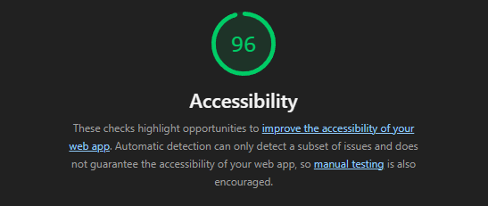
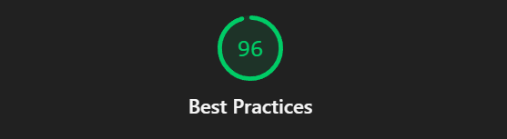

# Legislación y Cumplimiento Normativo - TuberIA

## Listado de Normativas Aplicables

TuberIA es una plataforma web que recoge datos personales de usuarios europeos, utiliza cookies para gestión de sesiones, ofrece contenido basado en vídeos de YouTube y debe cumplir con las siguientes normativas legales:

---

## 1. Protección de Datos - RGPD

### ✅ Implementado:

**Seguridad de los datos**:
- ✅ Cifrado de contraseñas con bcrypt (factor de coste: 10)
- ✅ Acceso restringido solo a usuarios autenticados (middleware authMiddleware)
- ✅ Almacenamiento seguro de tokens JWT
- ✅ Headers de seguridad con Helmet.js

### ❌ Por Implementar:

**Consentimiento explícito**: 
- Checkbox obligatorio en formulario de registro aceptando Política de Privacidad y Términos de Servicio

**Información transparente**: 
- Página `/legal/privacidad` con Política de Privacidad que explique:
  - Qué datos se recogen (username, name, email, contraseña hash, canales seguidos, historial de vídeos)
  - Finalidad del tratamiento (autenticación, personalización del servicio)
  - Base legal (consentimiento del usuario)
  - Tiempo de conservación de datos
  - Derechos del usuario

**Derechos de los usuarios**: 
- Endpoint GET `/api/users/me/export` - Exportar datos personales en formato JSON (portabilidad)
- Endpoint DELETE `/api/users/me` - Solicitar borrado de cuenta (derecho al olvido)
- Endpoint PUT `/api/users/me` - Rectificación de datos incorrectos
- Documentar derechos de oposición y limitación del tratamiento

---

## 2. Política de Cookies - Ley LSSI y ePrivacy

### ❌ Por Implementar:

**Banner de cookies**: Informar al usuario al entrar por primera vez y permitir aceptar/rechazar cookies no esenciales. Las cookies técnicas (autenticación) están exentas de consentimiento.

**Clasificación de cookies en TuberIA**:
- Técnicas (esenciales): `auth_token` para autenticación JWT - No requiere consentimiento

**Gestión de preferencias**: El usuario puede revocar el consentimiento en cualquier momento desde "Configuración de Cookies"

**Documentación**: Crear página `/legal/cookies` con listado de cookies y su finalidad

---

## 3. Condiciones de Uso y Términos de Servicio

### ❌ Por Implementar:

**Aceptación de términos**: Checkbox obligatorio "Acepto los Términos de Servicio" en el registro

**Uso permitido**:
- Servicio para uso personal y no comercial
- Prohibido usar bots o scraping automatizado
- Prohibido compartir credenciales de acceso

**Limitaciones de responsabilidad**: TuberIA no se responsabiliza de contenido de terceros (YouTube), inexactitudes en transcripciones automáticas o interrupciones del servicio

**Propiedad intelectual**: 
- Los resúmenes generados son propiedad del usuario
- TuberIA no reclama derechos sobre contenido generado
- Vídeos de YouTube pertenecen a sus creadores originales

**Suspensión de cuenta**: TuberIA puede suspender por uso fraudulento, violación de términos o actividad ilegal

**Ley aplicable**: Ley española y jurisdicción de tribunales de Cádiz, España

---

## 4. Accesibilidad Web - WCAG 2.1

### ✅ Implementado:

**Estructura semántica HTML5**: 
- ✅ Uso de etiquetas semánticas en componentes (header, nav, main)
- ✅ Jerarquía de encabezados correcta

**Navegación por teclado**: 
- ✅ Formularios navegables con Tab
- ✅ Elementos interactivos accesibles (botones, enlaces)

**Contraste de colores**: Auditoría WCAG AA (4.5:1 para texto normal, 3:1 para texto grande)

**Compatibilidad con lectores de pantalla**: Se ha añadido atributos ARIA donde sea necesario, garantizando así las mejores practicas posibles.

**Etiquetas alt en imágenes**: Todas las imágenes tienen atributo `alt` descriptivo.

**Test Lighthouse implementado para medir al accesibilidad y mejores prácticas**

---

## 5. Propiedad Intelectual

### ✅ Implementado:

**Recursos de terceros**:
- ✅ Lucide React (licencia MIT)
- ✅ Verificadas licencias de dependencias

---

## 6. Normativa Específica del Sector

### ✅ Implementado:

**Contenido generado por usuarios**: 
- ✅ TuberIA NO permite contenido generado por usuarios en fase MVP

### ❌ Por Implementar:

**Aviso Legal (LSSI-CE)**: Página `/legal/aviso-legal` con datos del responsable

---

## 7. Permisos y Autorizaciones

### ✅ Implementado:

No aplica: TuberIA en fase MVP no requiere permisos especiales

---

## 8. Plan de Implementación Técnica

### 8.1. Páginas legales (Frontend)

**Crear 4 páginas React en `/frontend/src/pages/Legal/`**:

| Ruta | Contenido | Archivo |
|------|-----------|---------|
| `/legal/privacidad` | Política de Privacidad (RGPD) | `PrivacyPolicy.jsx` |
| `/legal/cookies` | Política de Cookies | `CookiesPolicy.jsx` |
| `/legal/terminos` | Términos de Servicio | `TermsOfService.jsx` |
| `/legal/aviso-legal` | Aviso Legal (LSSI-CE) | `LegalNotice.jsx` |

### 8.2. Banner de cookies (Frontend)

**Crear componente en `/frontend/src/components/common/CookieBanner.jsx`**:
- Mostrar solo en primera visita (localStorage)
- Botón "Aceptar todas"
- Enlace a `/legal/cookies`

### 8.3. Checkbox de aceptación (Frontend)

**Modificar `/frontend/src/pages/Auth.jsx`**:
- Checkbox obligatorio: "Acepto la Política de Privacidad y Términos de Servicio"
- Enlaces a `/legal/privacidad` y `/legal/terminos`

### 8.4. Endpoints RGPD (Backend)

**Añadir en `/backend/src/routes/user.routes.js`**:
- **GET /api/users/me/export** - Exportar datos personales en JSON
- **DELETE /api/users/me** - Borrar cuenta y todos los datos
- **PUT /api/users/me** - Actualizar datos personales

---

## 9. Checklist de Cumplimiento Legal

### MVP - Necesario para cumplir con la legislación vigente
- [ ] Crear 4 páginas legales
- [ ] Implementar Banner de cookies
- [ ] Añadir checkbox de aceptación en registro
- [ ] Endpoint GET `/api/users/me/export`
- [ ] Endpoint DELETE `/api/users/me`
- [ ] Endpoint PUT `/api/users/me`

### Post-MVP
- [ ] Logs de auditoría de acceso a datos
- [ ] Traducción de políticas (EN)
- [ ] Test con lectores de pantalla
